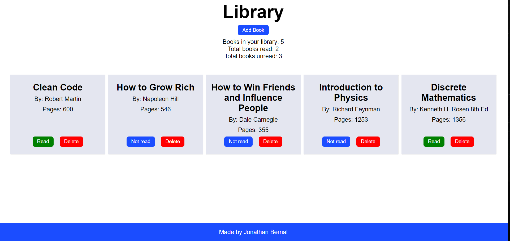

# Library Project

## Description
A library web page where you can add books to a list. Each book can be marked as read/unread and updated later if need be. The books are added by title, author, and number of pages.

## Purpose
The purpose of this project is to practice and showcase how object creation and instantiation and function scopes work in JavaScript.

## How to Run
You can open the `index.html` file located on the root directory of this repository.
Alternatively, you can also interact with the webpage by viewing the [live version](https://jonathanbernal.github.io/library/).

## Difficulties Faced When Making This Project
Since the purpose of this project was to work with function scopes and objects and to use more DOM manipulation, I wanted to experiment with breaking down each component into the smallest components I could think of. There are many helper functions that were created in order to generate the various DOM nodes needed to create each individual component for each book and instance of the dialog used to add books to the library. 

As an added exercise, I created every function component without relying on imports and exports. In an ideal scenario, it is best to separate each component in a separate file and import the component when needed.

At first, I wanted to make the book input dialog part of the HTML file, but I felt it was better to generate it dynamically and not make it readily available. I have not learned extensively about XSS attacks, but I felt that having an input readily available on the main page is not a good practice from both a security and accesibility point of view. 

Updating the book counters is a tedious task relying on several function calls. In an ideal scenario, one can create a stats board component with a state and manage the state. Once I learn more about React/Redux, I plan to switch to this approach entirely, as it would make the code easier to implement and easier to maintain.

During the early stages of the app, I also had an Show All Books button. When I tried to show all the books, I would create duplicate DOM nodes of the books that were stored in the library. Thinking about how I could fix this issue, I figured it was just both best and easier to display each book right after it was added. After all, no one would like to add a book and wonder whether or not the book was added to the library. It's much easier to see each book right after filling out all the required fields.

## Future Plans
In the future, I plan to revamp this project by dividing components into different files and making use of imports/exports to make the codebase more maintainable. I also plan to see how I can apply closures to this project to make certain props private. In addition, once I learn about React, I am planning to have React manage the state of this application through Redux. 

Other improvements could include fetching book covers and additional information about the book from a REST API and filling out the rest of the information by having the user type in the title only.
